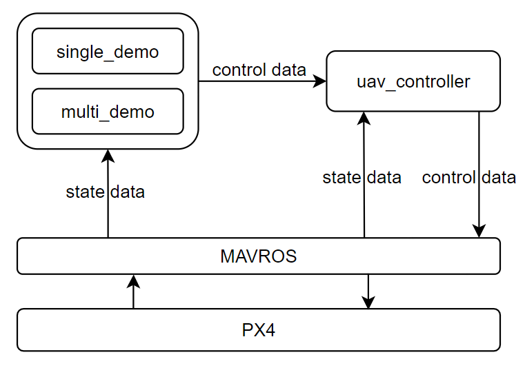

# 迅翼SwiftWing仿真平台

## 平台简介
ROS固定翼仿真平台旨在实现固定翼无人机决策、规划和控制仿真，区别于传统基于Matlab/Simulink的仿真方案，迅翼仿真平台做到了以下优化：  
- 高度封装：平台将基础无人机控制算法封装为可复用的类，从而有效简化了开发流程。同时，对各类基础数据的获取进行了封装，确保了数据访问的便捷性和一致性，极大提升了开发效率和数据处理的稳定性。  
- 分层解耦：基于模块化的分层架构设计，平台实现了规划层与控制层的解耦，省去了底层控制器设计和动力学建模的复杂过程。用户只需专注于上层控制算法的编写，避免了繁琐的底层细节，降低了开发门槛，提升了开发效率，为用户提供了更为流畅和高效的仿真体验。  
- 验证迅速：用户无需接触底层 PX4 控制逻辑，只需通过封装好的类接口读取状态数据并发送控制指令。同时，底层控制机型可灵活切换，使得验证过程更为迅速和高效，极大提升了开发和测试的便捷性。

## 技术框架
我们对整体架构进行了二次修改，完善了整体仿真流程，也简化了仿真二次开发流程，对于新手上手更加友好。 整体架构基于模块化设计，将仿真功能拆分为3个ROS功能包：uav_controller、single_demo、multi_demo，以提高系统的可扩展性以及可维护性。

- uav_controller功能包封装了固定翼和垂直起降无人机的底层控制器，支持姿态、位置和速度的精准控制。功能包提供了基于状态机设计的单机控制节点文件，具备高度灵活性和可扩展性。通过启动该功能包中的单机控制节点，用户可以实现一键起飞无人机、接收外部控制指令以及切换飞行模式，为复杂飞行任务的实现提供了高效可靠的解决方案。  
- single_demo 功能包旨在为用户提供单机数据的实例化获取，是用户进行二次开发的主要入口和核心目录。该功能包包含了 spawn-uav.py 文件，封装了常用的 MAVROS 话题数据订阅逻辑。用户只需在主程序中导入 uav 类，即可通过调用其属性轻松获取无人机的状态数据，如位置、速度、姿态等。这种高度封装的设计，不仅降低了开发复杂度，还显著提升了数据获取的便捷性和开发效率，为用户的二次开发提供了强大的支持。  
- multi_demo 功能包提供了一个 leader-follower 集群控制框架的实例和一个分布式一致性集群控制实例，切均支持灵活配置编队队形、领航者轨迹和跟随者数量。用户可以根据需求自由指定这些参数，从而实现高度可定制的集群控制方案。这两个实例具有良好的扩展性，便于用户在此基础上进行应用开发和功能拓展。 整体架构如下： 

整体流程为：

- 从uav_controller中选择一款机型(固定翼、垂起)，启动单机底层控制节点；  
- 在single_demo中编写自己的上层控制代码，启动上层控制节点；  
- 仅需一条roslaunch指令，即可开启仿真。这样架构下，用户只需要专心编写自己的上层控制代码，底层控制节点可切换、可扩展。  

## 后续计划

- 添加多机混合机型编队仿真；
- 适配AP+ROS2以及PX4+ROS2；
- 添加视觉、激光雷达等其他传感器支持。

## 使用文档

https://swiftwing001.github.io/swiftwing-simulation-tutorial/
